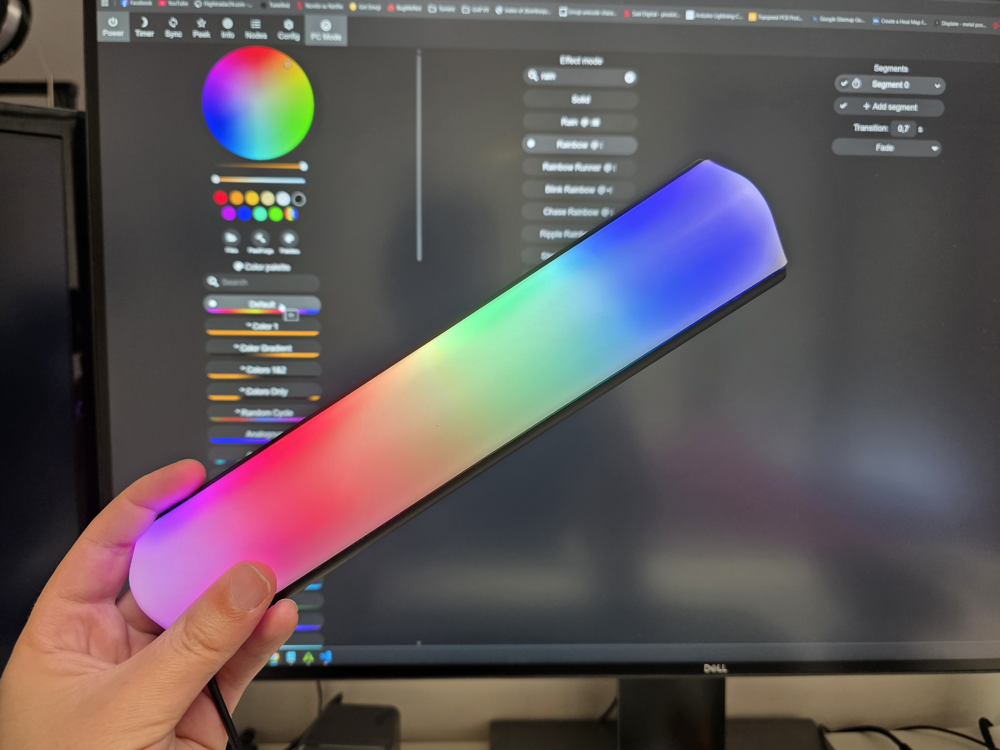
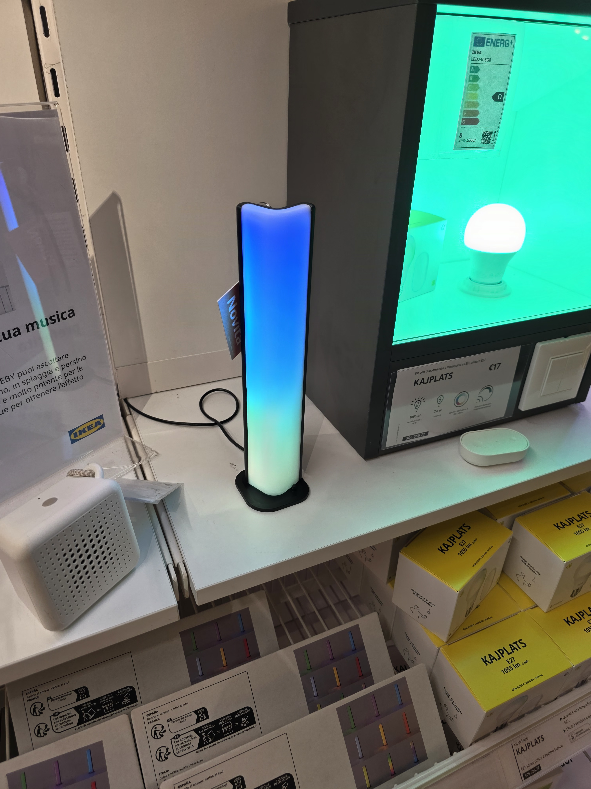
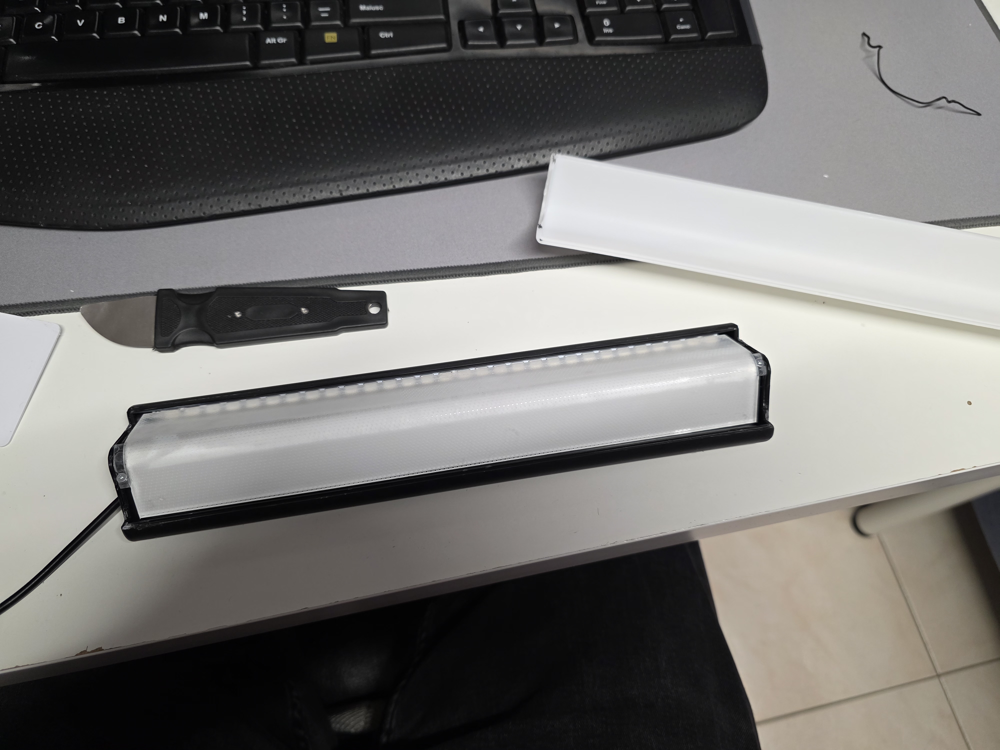
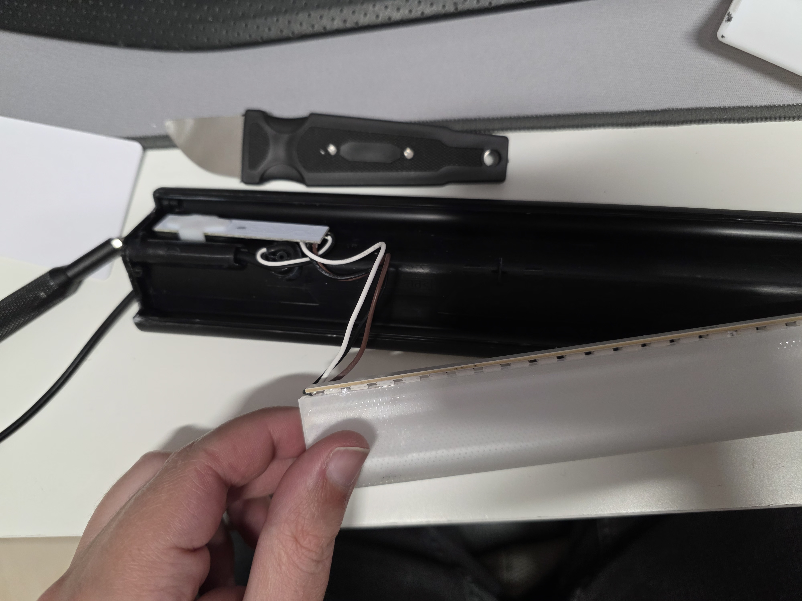
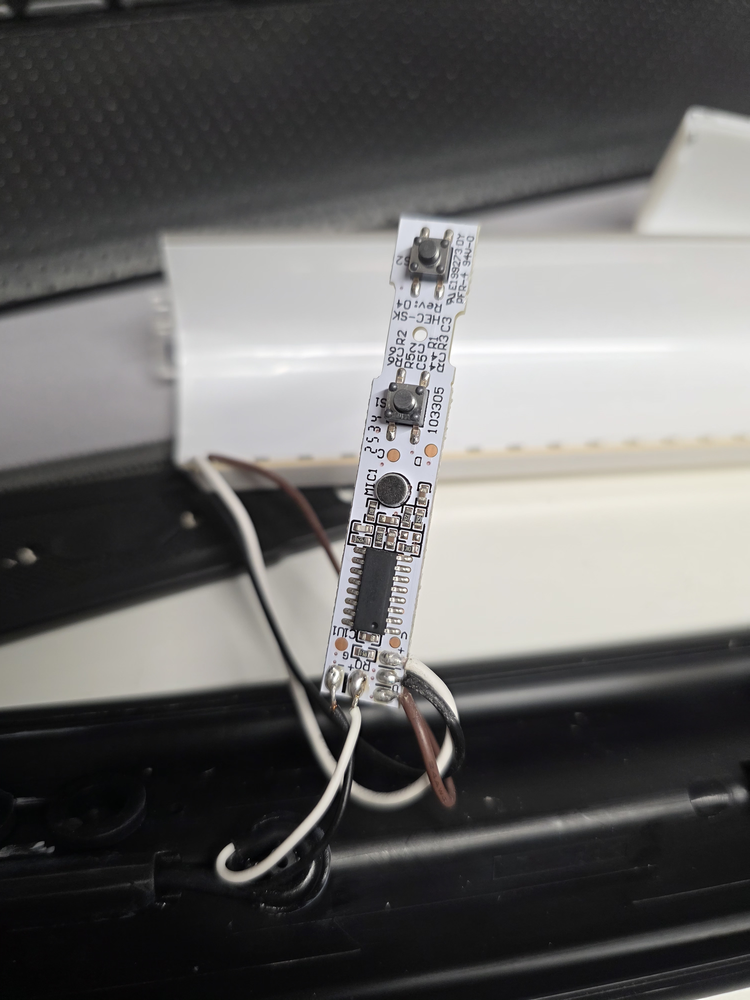
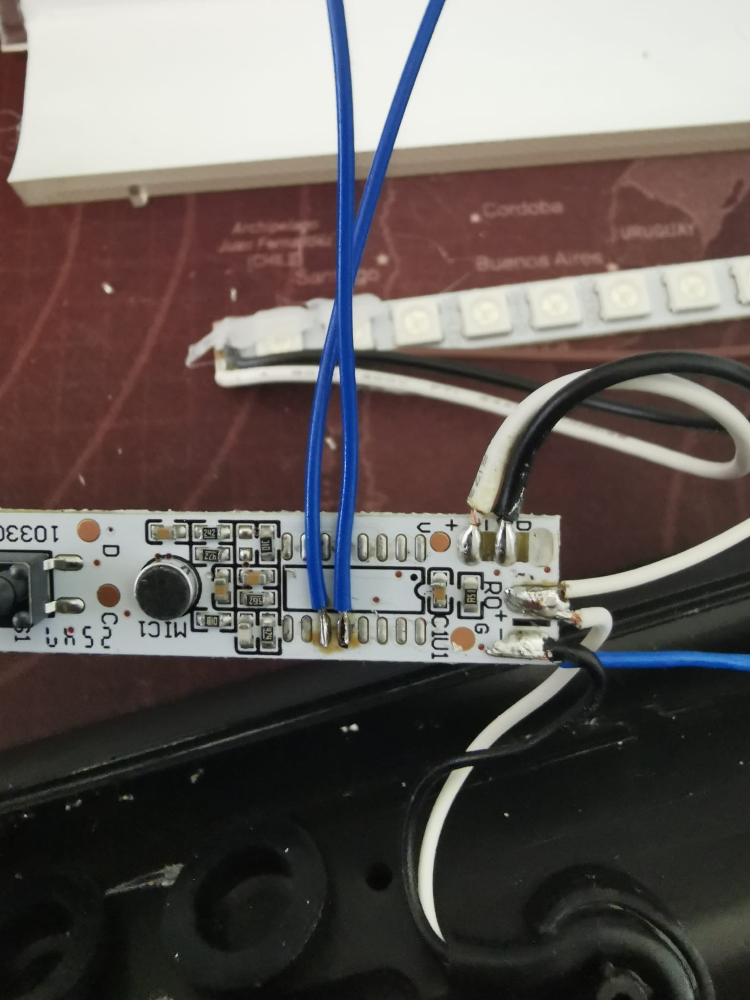
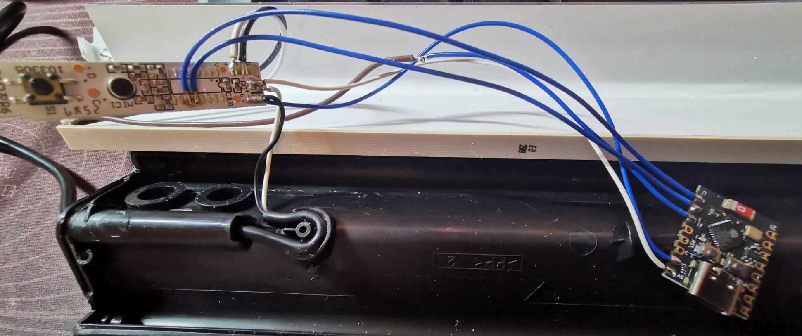
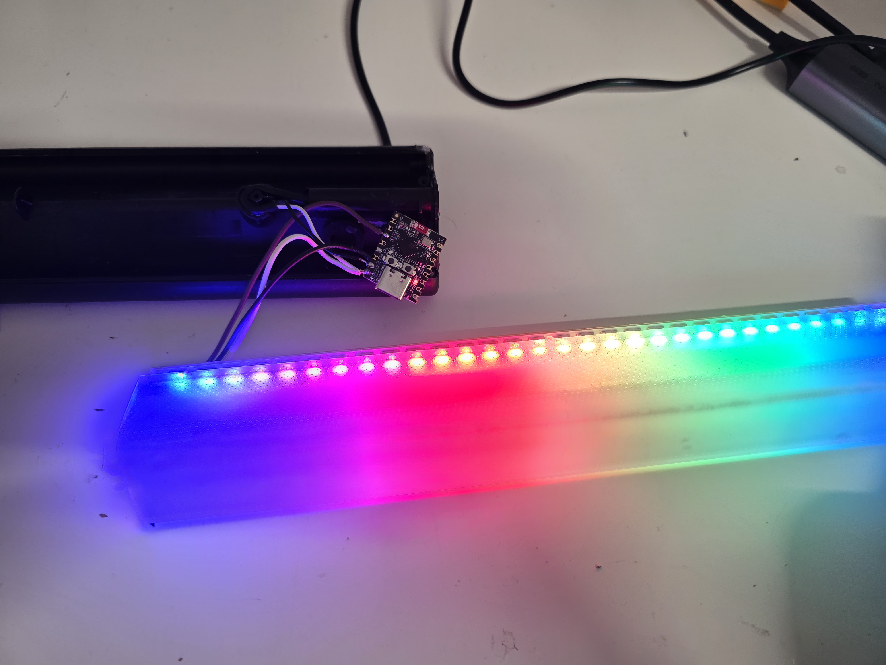
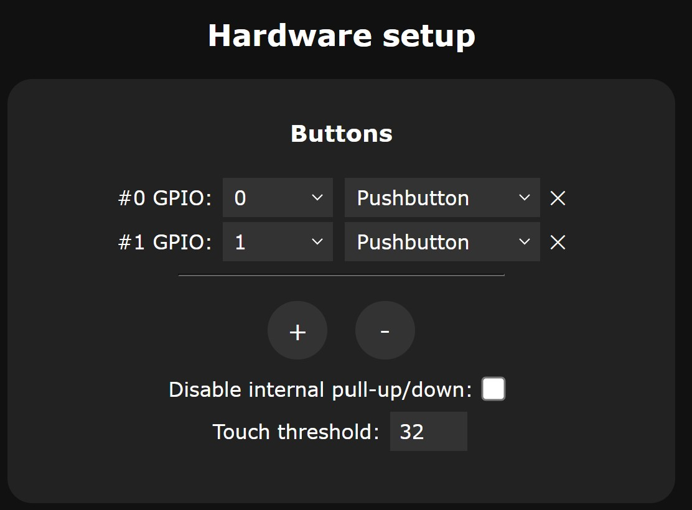

# Modding the IKEA SKAFTSÄRV with an ESP32 and WLED

## Quick Start

This mod is very straightforward once the lamp is opened and the original control board is removed.

Wire the ESP32 to the lamp’s LED strip like this:

- **Black** -> **GND**
- **White** -> **5V**
- **Brown** -> **Data (GPIO 2)**

Then open the **WLED** interface and set the following options:

- **LED count:** `30`
- **Color order:** `GRB`
- **LED type:** `WS281x`

After that, the lamp should light up correctly with WLED.

---

## Detailed Guide

### Step 1 — Buy the lamp

Go to your local IKEA store and pick up the lamp first.

### Step 2 — Open the lamp

Use a prying tool to carefully open the lamp body.

The lamp is lightly glued at the top and bottom, so do this slowly to avoid damaging the housing. Once the modification is complete, it should be glued back together again.

### Step 3 — Remove the control board

Remove the two side screws that hold the control board in place, then lift the board out.

Underneath, you will find the control board with the two buttons and the microphone. Unfortunately, the support bracket is glued in place, so removing it will require breaking it free by force.

### Optional step — Keep the original buttons

If you want to keep the original button functions, the simplest way is to remove the original IC from the board and wire the two button pins directly to the ESP32.

Button 1 is on **pin 3** and Button 2 is on **pin 4**.

Wire the buttons to the ESP32 like this:

- **Button 1 / pin 3** -> **GPIO 0**
- **Button 2 / pin 4** -> **GPIO 1**

### Step 4 — Install the ESP32

I used an **ESP32-C3 SuperMini**.

I recommend placing it in the cavity opposite the one where the original control board was located, so it stays farther away from the heat generated by the LEDs.

Connect the wires as follows:

- **Black** to **GND**
- **White** to **5V**
- **Brown** to **GPIO 2** for data

### Step 5 — Configure WLED

In WLED, set:

- **LED count:** `30`
- **Color order:** `GRB`
- **LED type:** `WS281x`

Save the configuration and test a few colors to confirm everything is working.

If you connected the original buttons, also configure:

- **Button 1:** `GPIO 0`
- **Button 2:** `GPIO 1`

### Step 6 — Reassemble

Put everything back together, close the lamp, and glue the shell again if needed.

At this point the lamp is ready to use with WLED.

---

## Final Result

The lamp now works as a smart WLED-controlled light, powered by an ESP32-C3 SuperMini and ready for custom effects, colors, and automation.
